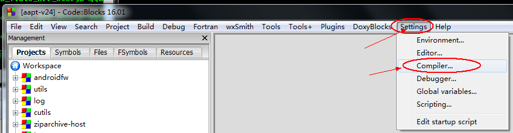
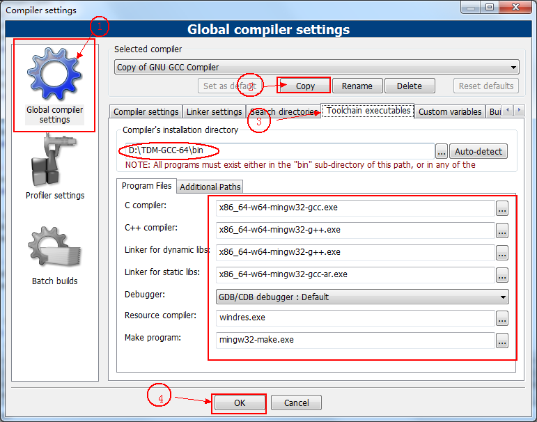
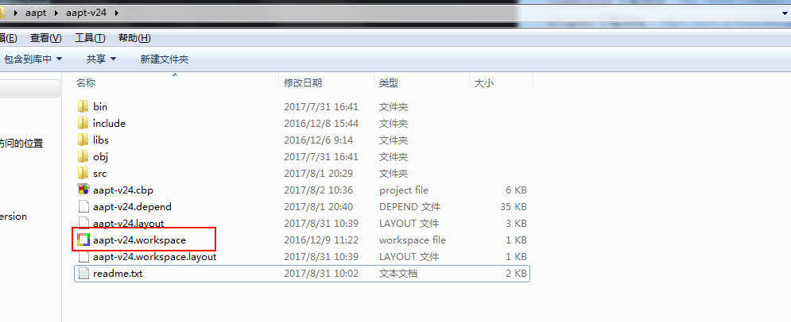
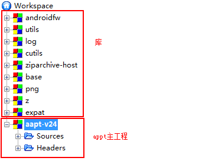
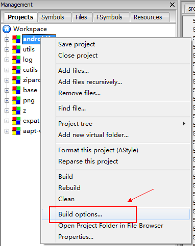
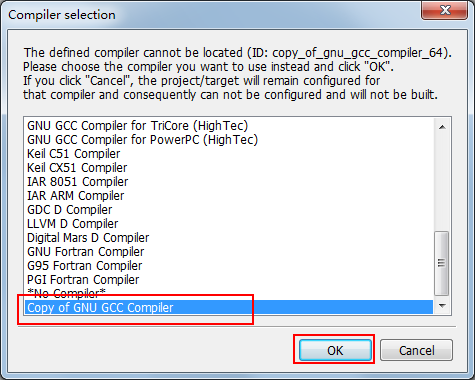
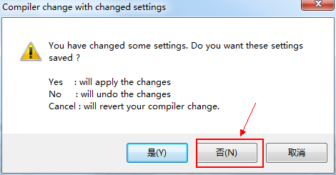

##一、环境配置
### 1.1 软件和源码

`Codeblocks`下载地址：http://www.codeblocks.org/downloads
`mingw64`下载地址：https://jaist.dl.sourceforge.net/project/tdm-gcc/TDM-GCC%20Installer/
`aapt`源码地址（为了避免麻烦，特地弄好了`aapt`的`Codeblocks`项目，直接从我的`github`上`clone`下来就能在`Codeblocks`中用）：https://github.com/ClaymanTwinkle/aapt 
### 1.2 软件配置

> 软件安装好了就要先配置下

#### 1.2.1`Codeblocks`配置`Compiler`
**步骤一：**
选择进入工具栏 `Settings` >> `Compiler`，如下图所示；

**步骤二：**
（1）选择`Global compiler settings`；
（2）在`Selected compiler`中选择`GNU GCC Compiler`，然后下方点击`Copy`按钮，就会出现`Copy of GNU GCC Compiler`；
（3）在下方`Toolchain executables`配置`mingw64`，相关配置如下图所示；
（4）最后选择`OK`即可；

配置好编译环境后，就可以打开项目了；进入`aapt/aapt-v24`中打开`aapt-v24.workspace`；

工程目录结构如下图所示；

#### 1.2.2 为每个工程配置`Compiler`
**步骤一：右键一个工程，在右键菜单中选择`Build Options`；**

**步骤二：第一次配置的时候，会出现一个弹窗，如下图；选择刚刚自己创建的`Copy of GNU GCC Compiler`，点击确定；**

**步骤三：注意，如果此时，出现以下对话框，请选择`否`；**

> 对每个工程重复以上步骤；